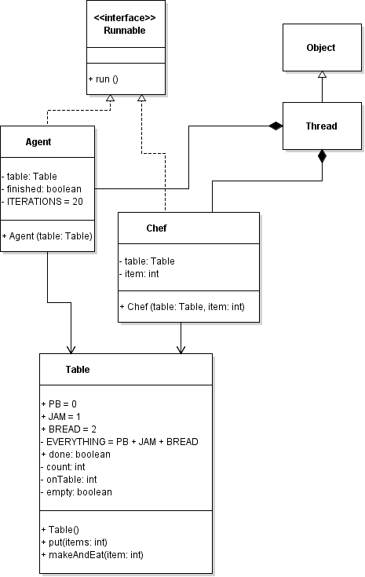

# ASSIGNMENT 1: The Sandwich Making Chefs Problem :hamburger:

#### README Contents:
<ul>
<li>UML Class Diagram</li>
<li>UML Sequence Diagram</li>
<li> Naming and Organization of Files </li>
		<ul> <li>Execution Instructions</li>
		<li>Class Descriptions</li>
		</ul> </ul>
		
### UML Class Diagram 
This can also be found as a png file in the project zip file. 

### UML Sequence Diagram
This can also be found as a png file in the project zip file.

### Naming and Organization of Files

#### Execution Instructions
You may either execute the program via the .jar file (typing 'java -jar SYSC3303A1MariamA' on the cmd line) or by running the program directly in eclipse. The class that contains the main method to run is called "Main". All source files are in the jar file and also in the project folder (zipped). 

#### Main
This program's main class acts as the producerConsumer class. It simply consists of the main method that creates the components of the three chefs problem (the table, the agent, and the three chefs). It then starts all the required threads (agent and chefs).

#### Chef
This class is used to encapsulate the behaviour of the chefs. It must contain a reference to the table that it is working at. To create a chef object, we must also specify what item that specific chef has. Because there are only 3 ingredients or items in this problem, and integer was assigned to each ingredient. Both of these parameters (the item/ingredient and the table) must be passed to the chef constructor. 

This class implements Runnable and as such it overrides the run() method. In the Chef's run() method, it keeps attempting to make and eat a sandwich until the agent is finished. 

#### Agent
The agent is the producer. It provides the table with two of the three ingredients. It has an instance of a table and controls the iterations (i.e. the number of sandwiches made and eaten). 

#### Table
This class acts as the bounded buffer. It controls what threads can run and which have to wait until a condition is satisfied. For example, the agent thread cannot run (i.e. put two ingredients on the table) unless the table is empty. The chefs cannot make and eat the sandwich unless the table has the ingredients on it and the chef has the missing item. In the method called makeAndEat(), which the chefs call, some time is given for the chefs to make and eat their sandwich (I set it to half a second). 